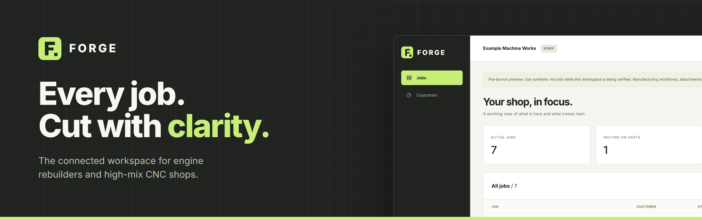
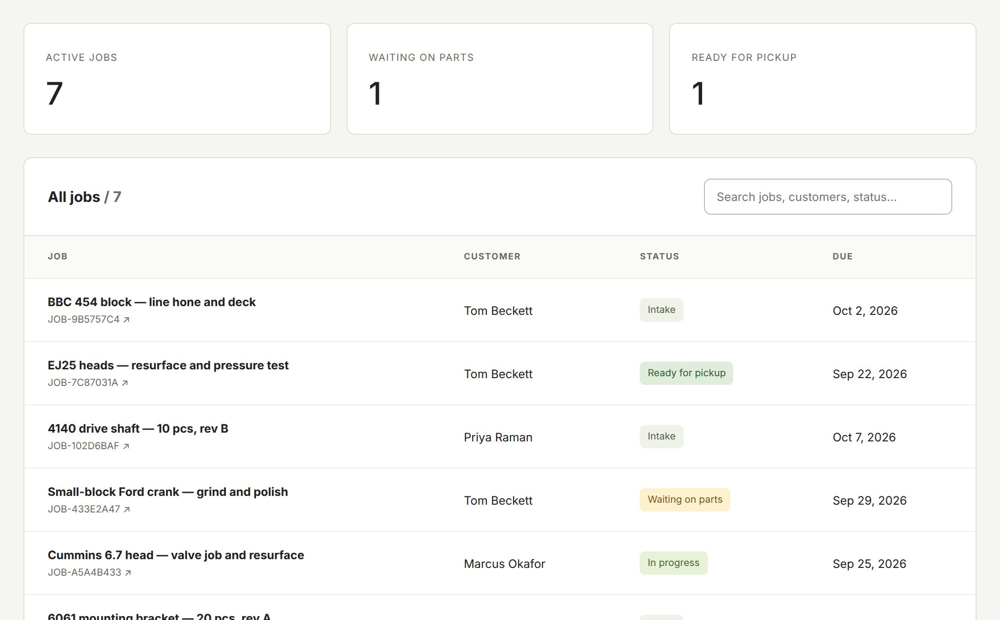
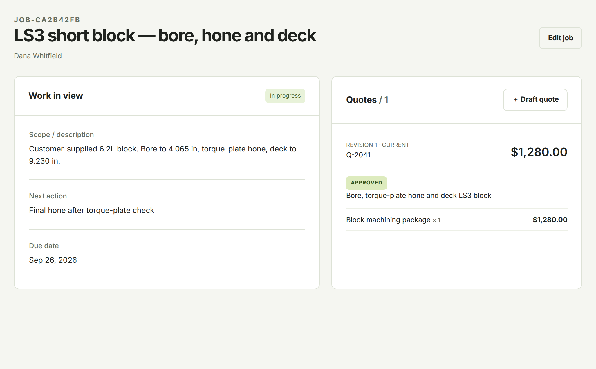
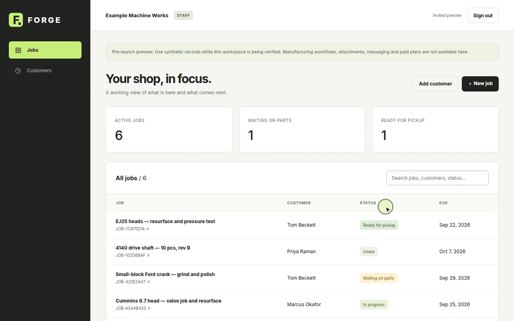
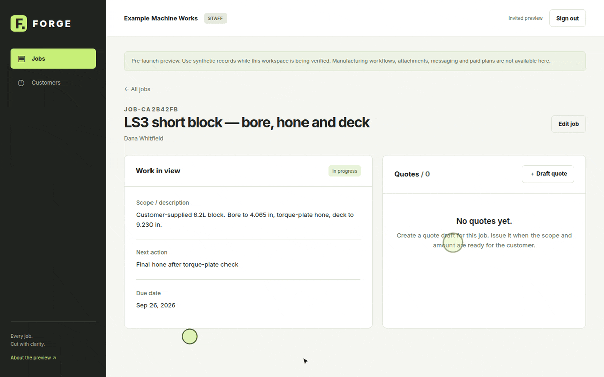
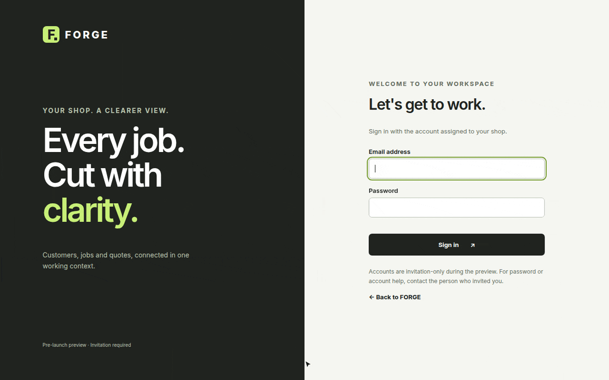
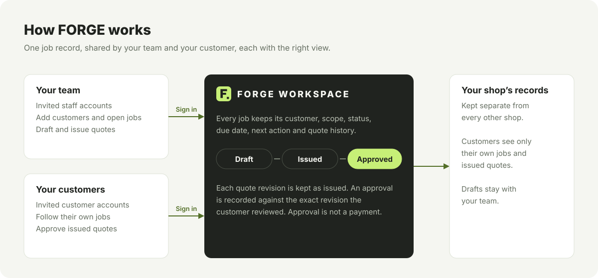
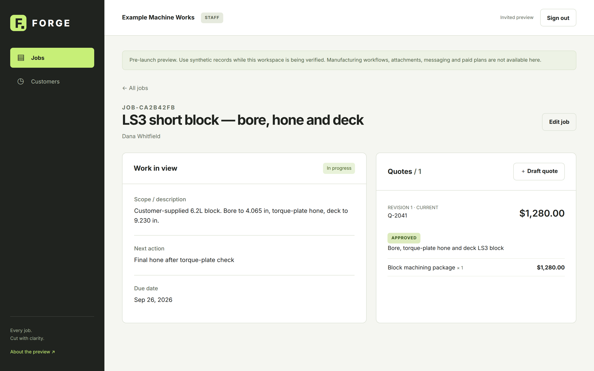
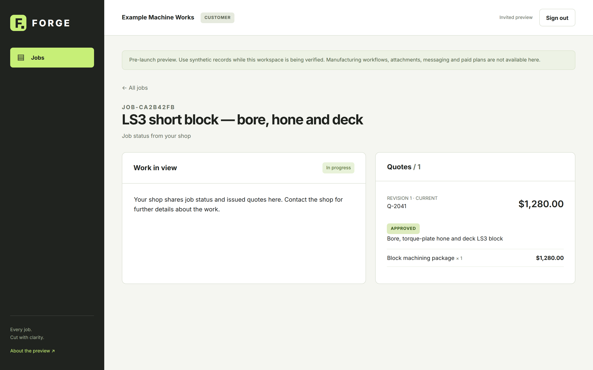

  

  
  

  <a href="docs/getting-started.md"><b>Get started</b></a> ·
  <a href="docs/README.md"><b>Documentation</b></a> ·
  <a href="docs/faq.md"><b>FAQ</b></a> ·
  <a href="docs/support.md"><b>Request access</b></a>

---

**FORGE keeps every shop job in one place:** the customer, the work, where it stands, what happens next, and the quote your customer approved. Your team and your customer work from the same record, and each sees the view that fits.

  

The FORGE workspace with synthetic demonstration data. <a href="assets/demo/overview-still.png">View as a still image</a>.

## Who it's for

FORGE is built for shops where the job itself carries the context: what came in, what was agreed, and what is waiting.

| Engine rebuilders | High-mix CNC shops |
| --- | --- |
| Customer-owned blocks, heads and assemblies | Short runs against drawings and revisions |
| Work that changes as parts are torn down and inspected | Jobs that depend on the right revision and material |
| Customers who want to know where their engine is | Customers who need a clear quote before work starts |

It serves shop owners and coordinators who run the work, the team on the floor, and the customers who are waiting on it.

## What you can do

<table>
  <tr>
    <td width="33%" valign="top">
      
      <h3>See every job at a glance</h3>
      Active work, what is waiting on parts, and what is ready for pickup. Search by job number, title, customer or status.
    </td>
    <td width="33%" valign="top">
      
      <h3>Quote with a clear trail</h3>
      Every quote is a numbered revision that never changes once saved. Issue it when it is ready; the approval is recorded against that exact revision.
    </td>
    <td width="33%" valign="top">
      
      <h3>Give customers their own view</h3>
      Customers sign in to follow their own jobs and approve the quotes you issue. Drafts stay with your team.
    </td>
  </tr>
</table>

## See it in action

**Open a job.** Add the work, the customer, a due date and the next action.

**Quote and issue.** Draft a revision, check it, and issue it to the customer.

**Customer approval.** Your customer signs in, reviews the issued quote and approves it.

All recordings use synthetic demonstration data. Still images: <a href="assets/demo/new-job-still.png">open a job</a> · <a href="assets/demo/quote-still.png">quote and issue</a> · <a href="assets/demo/customer-approval-still.png">customer approval</a>.

## Get started

FORGE runs in your browser. There is nothing to install.

1. **Sign in** with the invitation for your shop.
2. **Add a customer**: name, and optionally email, company and phone.
3. **Open a job** for that customer with a title, status, due date and next action.
4. **Draft a quote** with the scope, a line item, quantity and price.
5. **Issue the quote**. It appears in your customer's view.
6. **Your customer approves** it from their own sign-in.

The [getting started guide](docs/getting-started.md) walks through each step with screenshots.

## How it works

- **One job record.** Customer, scope, status, due date, next action and quote history live together.
- **Two views.** Your team works on the job. Your customer sees their jobs and the quotes you issue.
- **Separate by shop.** Each shop's records are kept apart, and every account is by invitation.

## Screenshots

<table>
  <tr>
    <td width="50%" valign="top"> Job list</td>
    <td width="50%" valign="top"> Job page with quote history</td>
  </tr>
  <tr>
    <td valign="top"> Customers</td>
    <td valign="top"> What your customer sees</td>
  </tr>
  <tr>
    <td valign="top"> Sign in</td>
    <td valign="top" align="center"> On a phone</td>
  </tr>
</table>

## Availability

FORGE is in an **invited preview**. Accounts are created by invitation for participating shops and their customers.

| Available in the preview | Not yet available |
| --- | --- |
| Staff and customer sign-in by invitation | Self-service sign-up and password reset |
| Customers and jobs | Manufacturing workflows |
| Job status, due dates and next actions | Attachments |
| Quote revisions, issuing and customer approval | Email and text messaging |
| | Paid plans |

## FAQ

<b>Do I need to install anything?</b>

No. FORGE runs in a current web browser on a desktop, tablet or phone.

<b>Can my customers see everything in a job?</b>

No. Customers see their own jobs and the quotes you issue to them. Drafts and other customers' work are never shown. See [what customers see](docs/guides/customers.md#what-customers-see).

<b>Does approving a quote take a payment?</b>

No. Approval records the customer's acceptance of the quote's scope and amount. It does not make a payment.

<b>How do I get access?</b>

FORGE is invitation-only during the preview. See [Support and access requests](docs/support.md).

More answers are in the [full FAQ](docs/faq.md).

## Support

- **Using FORGE:** the [documentation](docs/README.md) covers every screen in the preview, and [troubleshooting](docs/troubleshooting.md) explains each message you might see.
- **Access, account help and everything else:** see [Support and access requests](docs/support.md).

## License

FORGE is proprietary software and is not distributed through this repository. The documentation, images and recordings here are © 2026 Seasx11, all rights reserved. See [LICENSE](LICENSE).

---

   
  <b>FORGE</b> · Every job. Cut with clarity.

