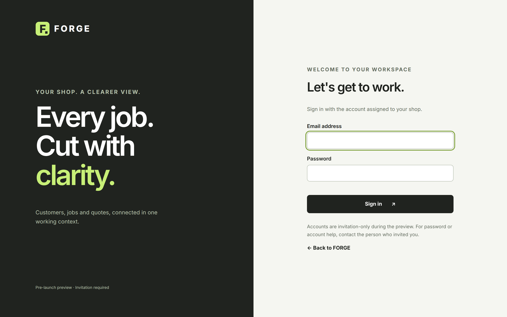
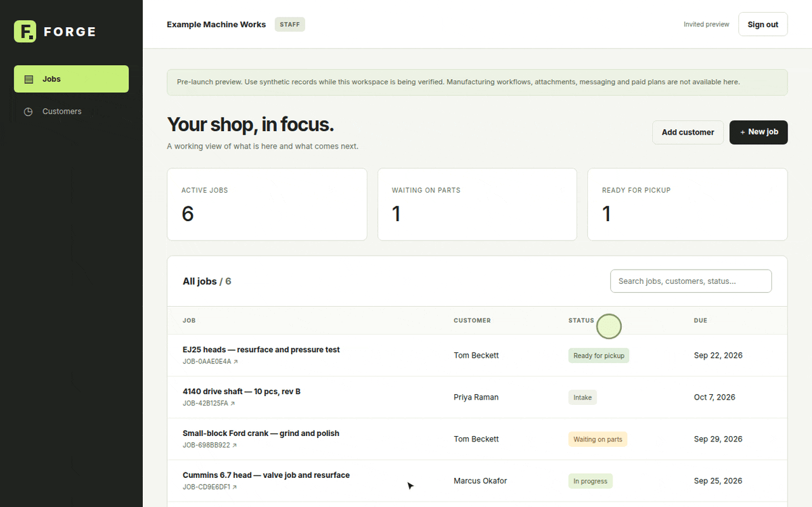
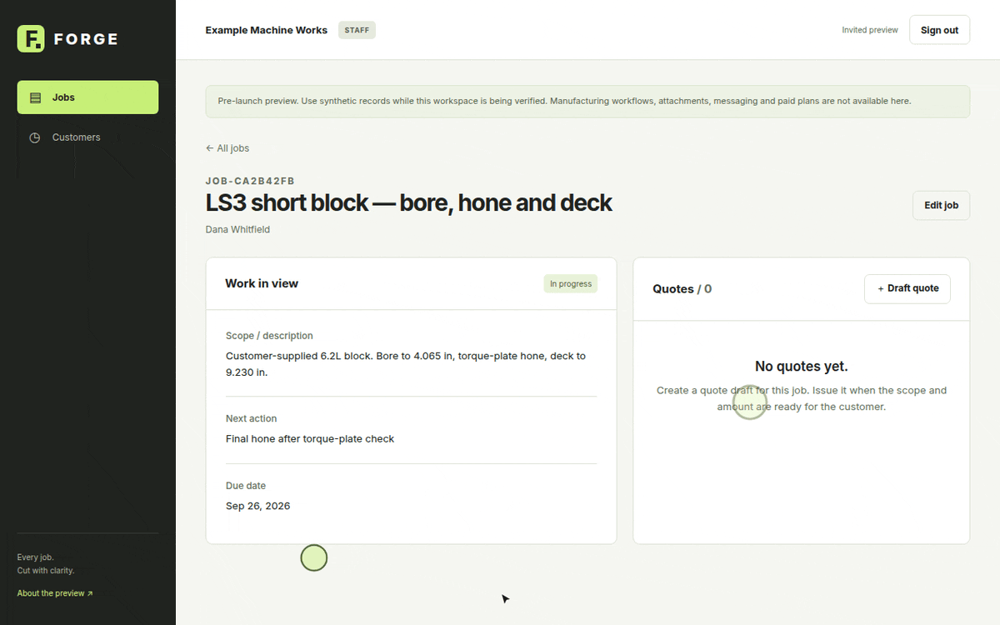
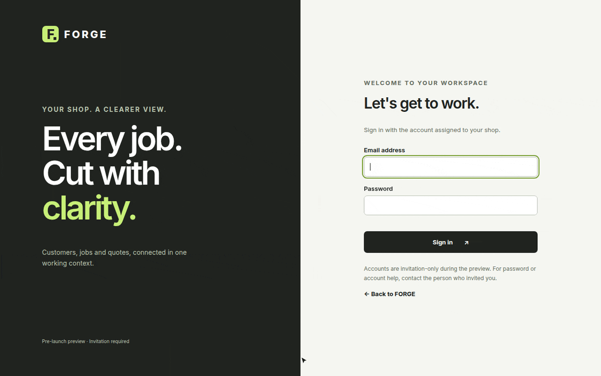

[Documentation](README.md) › Getting started

# Getting started

This guide takes a new shop from its first sign-in to a customer-approved quote in the hosted workspace. It takes about five minutes. You need a FORGE invitation for your shop and a current web browser.

## 1. Sign in

Open the invitation link for your shop and sign in with the email address and password for your account.

If you belong to more than one shop, use the invitation link for the shop you want to work in. For password or account help, contact the person who invited you. See [Accounts and access](account-and-access.md) for details.

## 2. Add your first customer

Every job belongs to a customer, so FORGE asks you to add one before your first job.

1. Select **Add customer**.
2. Enter the **Customer name**. **Email address**, **Company** and **Phone** are optional.
3. Select **Add customer** to save.

Adding a customer record does not send them an invitation or an email. Customer sign-in accounts are set up by invitation; see [Accounts and access](account-and-access.md#customer-accounts).

## 3. Open a job

1. Select **＋ New job**.
2. Enter a **Job title** and choose the **Customer**.
3. Optionally add the **Scope / description**, **Status**, **Due date** and **Next action**.
4. Select **Create job**.

FORGE assigns a job number such as `JOB-3F9A21C4` and opens the job page. New jobs start in **Intake** unless you choose another status.

## 4. Keep the job current

On the job page, select **Edit job** to change the title, scope, status, due date or next action as the work moves. The job list shows the status and due date of every job, and the counts at the top show active work, jobs waiting on parts and jobs ready for pickup.

See the [jobs guide](guides/jobs.md) for statuses and search.

## 5. Draft and issue a quote

1. On the job page, select **＋ Draft quote**.
2. Enter the **Scope**, an optional **Reference**, a **Line item**, the **Quantity** and the **Unit price (USD)**.
3. Select **Create draft**. The draft is saved as a numbered revision.
4. When it is ready for your customer, select **Issue to customer**.

Drafts are never shown to customers. Once issued, the revision appears in your customer's view. See [Quotes and approvals](guides/quotes-and-approvals.md).

## 6. Your customer approves

Your customer signs in with their own account, opens the job, selects **Review approval** and then **Approve quote**. The approval is recorded against that exact revision, and the quote shows **Approved** on your job page.

Approval records the customer's acceptance of the quote's scope and amount. It does not make a payment.

## Related

- [Concepts](concepts.md)
- [Jobs](guides/jobs.md)
- [Quotes and approvals](guides/quotes-and-approvals.md)
- [Troubleshooting](troubleshooting.md)
