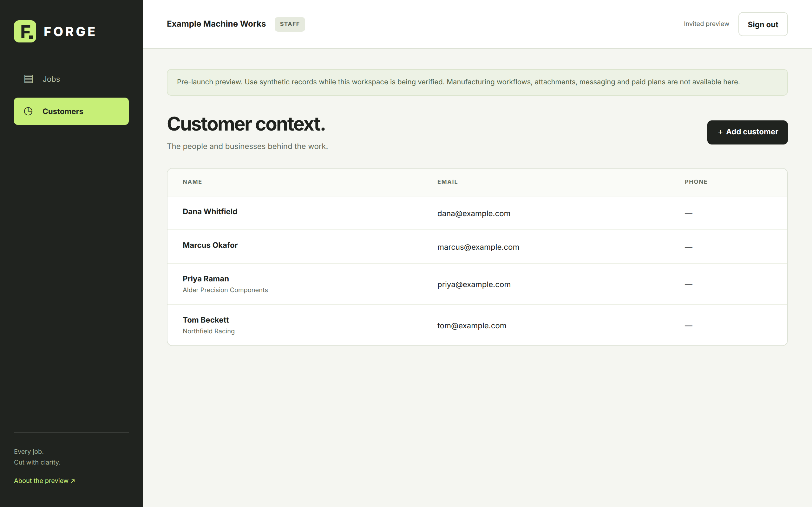
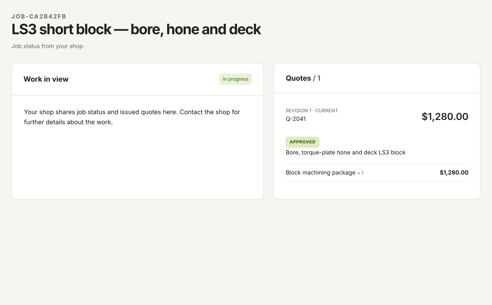
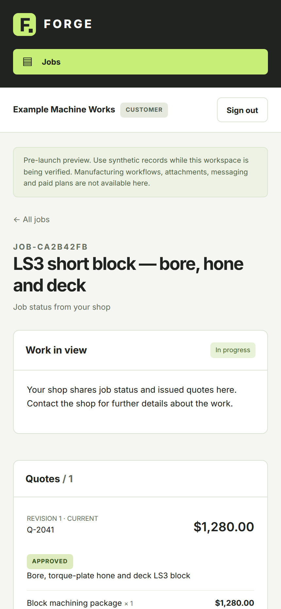

[Documentation](../README.md) › [Guides](../README.md#guides) › Customers

# Customers

Customers are the people and businesses your shop does work for. Every job belongs to one customer.

## Add a customer

1. Select **Customers**, then **＋ Add customer**. You can also select **Add customer** from the job list.
2. Enter the **Customer name**. **Email address**, **Company** and **Phone** are optional.
3. Select **Add customer**.

The customer list shows each customer's name, company, email address and phone number.

Adding a customer does not send them anything or create a sign-in for them. See [customer accounts](../account-and-access.md#customer-accounts).

## What customers see

When your customer signs in, FORGE shows only their own jobs.

| Customers see | Customers never see |
| --- | --- |
| Their jobs, with job number, title and status | Other customers' jobs |
| Every quote revision you have issued to them | Quote drafts |
| Which revision they approved | Other shops' records |

From an issued quote, the customer can select **Review approval** to approve it. See [Quotes and approvals](quotes-and-approvals.md#customer-approval).

The customer view works on a phone as well as a desktop.

## Related

- [Accounts and access](../account-and-access.md)
- [Quotes and approvals](quotes-and-approvals.md)
- [Jobs](jobs.md)
