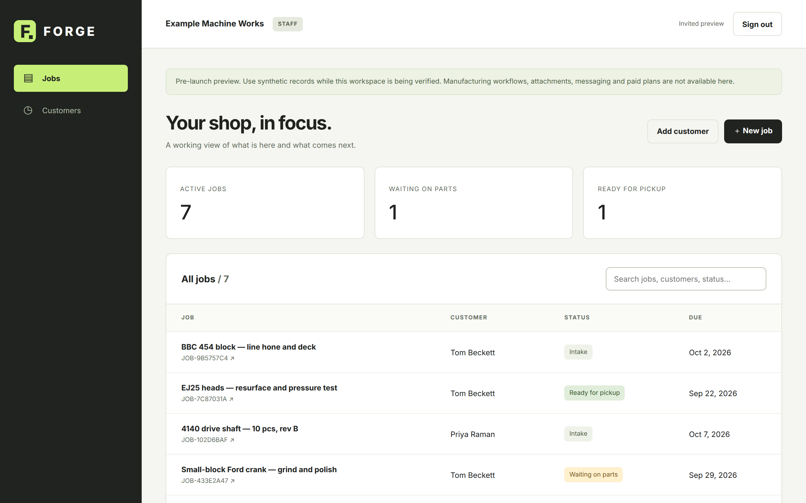

[Documentation](../README.md) › [Guides](../README.md#guides) › Jobs

# Jobs

A job is one piece of work for one customer. This guide covers opening a job, keeping it current and finding it again.

## Open a job

You need at least one customer first. If you have none, FORGE opens **Add a customer** for you.

1. On the job list, select **＋ New job**.
2. Fill in the form:

   | Field | Required | Notes |
   | --- | --- | --- |
   | Job title | Yes | Up to 160 characters |
   | Customer | Yes | Cannot be changed after the job is opened |
   | Scope / description | No | What the work includes |
   | Status | No | Starts as **Intake** |
   | Due date | No | |
   | Next action | No | The next thing that needs to happen |

3. Select **Create job**. FORGE assigns a job number and opens the job page.

## Keep a job current

On the job page, select **Edit job**, change what has moved, and select **Save changes**. Update the status and next action as the work progresses so the whole team sees the same picture.

If someone else saved the same job while you were editing, FORGE shows *Job changed. Refresh before editing.* Refresh the page, check their changes, and edit again.

## The job list

The job list shows every job in your shop with its customer, status and due date. The counts at the top show:

| Count | Includes |
| --- | --- |
| Active jobs | Every job that is not **Completed** |
| Waiting on parts | Jobs with the status **Waiting on parts** |
| Ready for pickup | Jobs with the status **Ready for pickup** |

Use the search box to filter by job number, title, customer name or status. Select a job's title to open it.

## Statuses

| Status | Use it when |
| --- | --- |
| Intake | The job has arrived and is being assessed |
| In progress | Work is under way |
| Waiting on parts | Work is paused until parts or material arrive |
| Ready for pickup | The work is done and waiting for the customer |
| Completed | The job is closed |

## Related

- [Quotes and approvals](quotes-and-approvals.md)
- [Customers](customers.md)
- [Concepts](../concepts.md)
